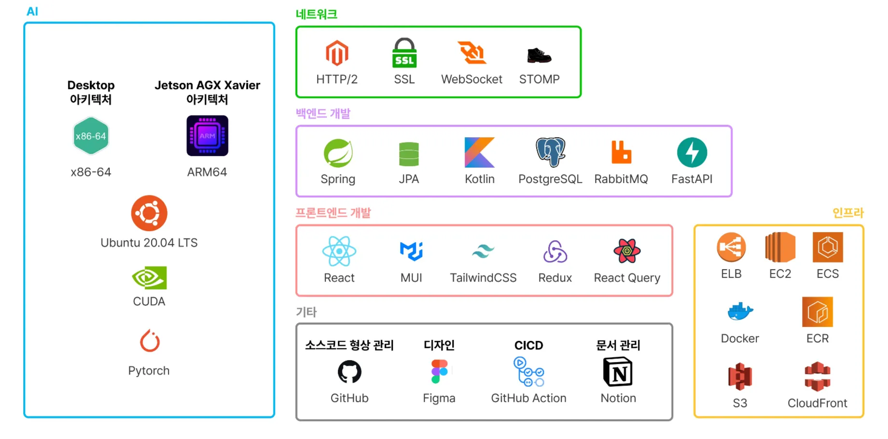
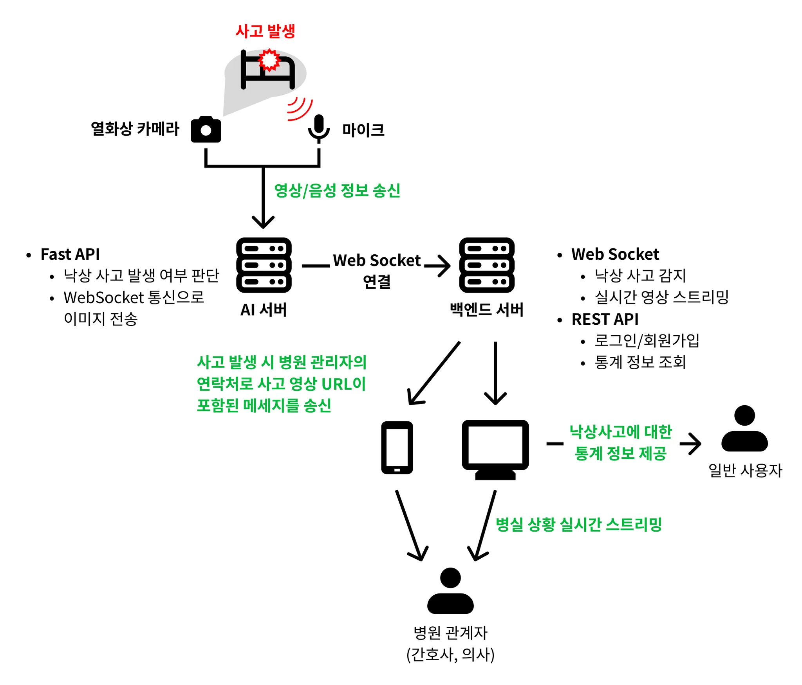
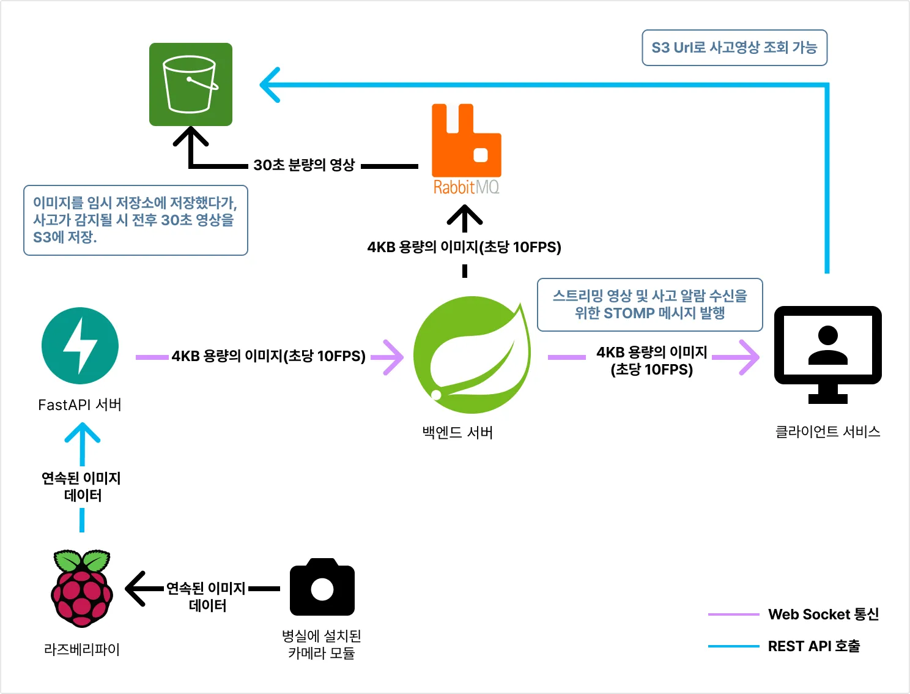
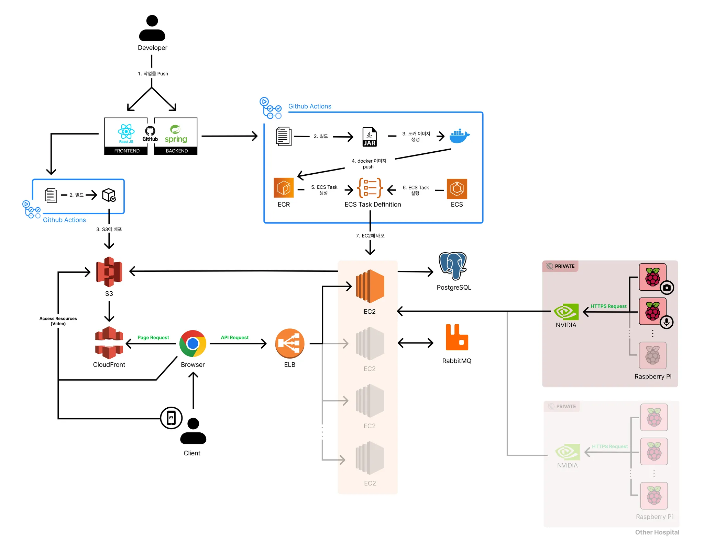
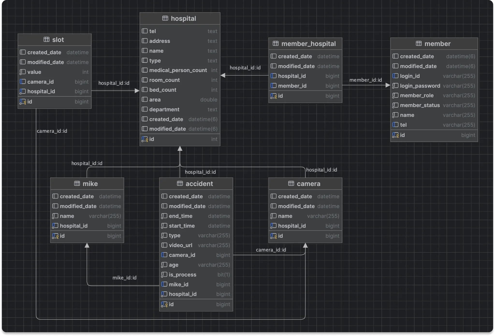
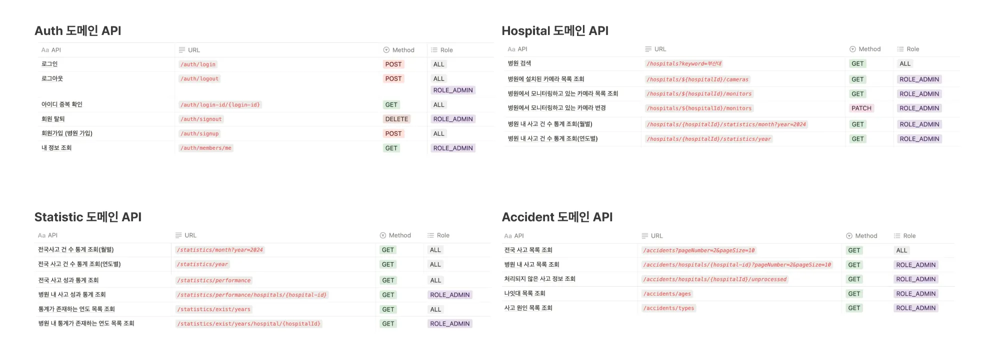
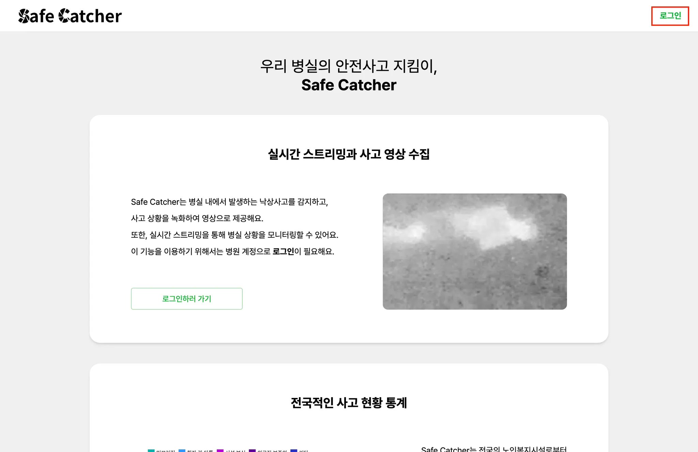
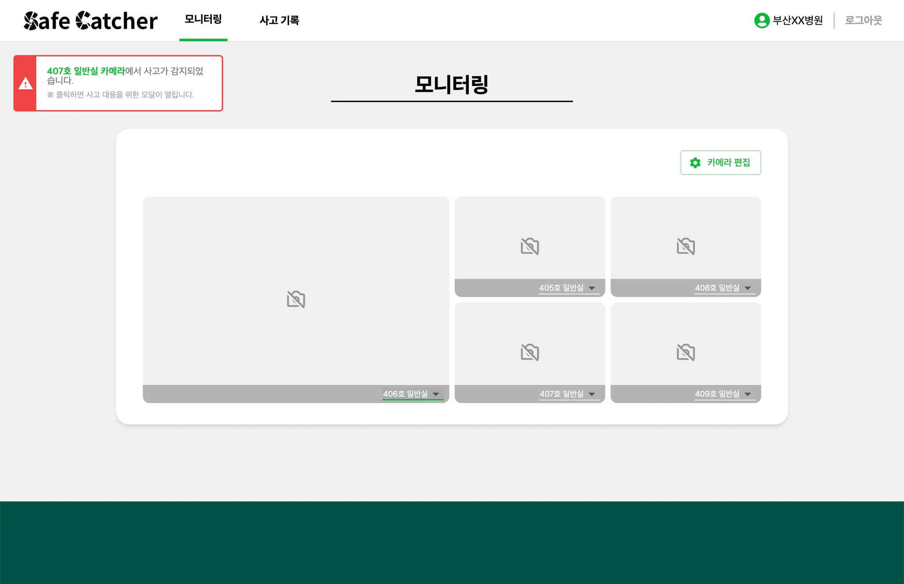
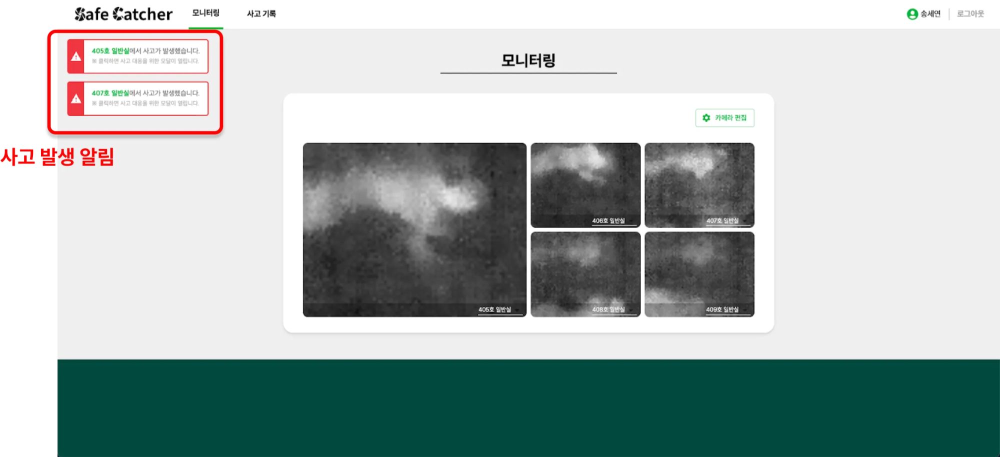
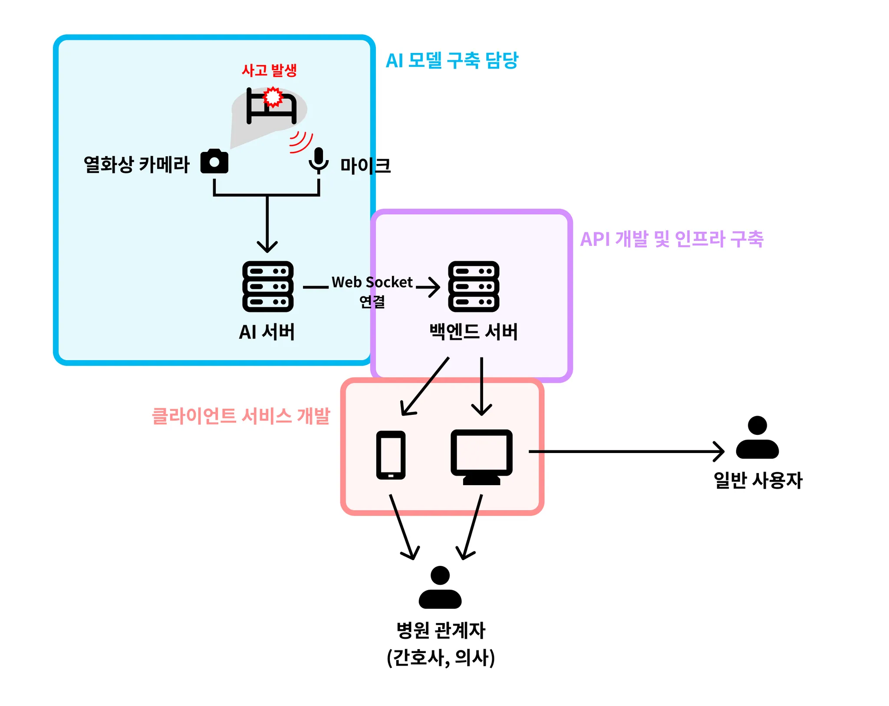

## 1. 프로젝트 소개

### 1.1 배경 및 필요성

 최근 3년간 요양병원에서 발생한 환자 안전사고를 유형별로 분류한 결과, 낙상이 절반 이상을 차지하였으며, 중증 및 사망으로 이어지는 비율 또한 낙상에서 가장 높았다. 골든아워를 지키기 위해 신속하게 사고 발생 여부를 파악하는 것은 중요하나, 모니터링을 위해 RGB 카메라를 이용할 경우 환자의 사생활 침해 문제가 발생한다. 현재 사용되고 있는 시스템들은 mmWave 레이더 센서를 이용하고 있으나, 측정 범위가 약 4m에 불과하여 장비 구축 비용이 많이 발생한다. 또한 mmWave 레이더 센서를 통하여 얻은 포인트 클라우드로는 사고 발생 및 대처 과정을 해석하기 어렵다는 문제가 있다. 이러한 문제를 해결하기 위해 열화상 카메라를 이용하여 사고 발생 상황을 녹화하고, 음향을 이용하여 넓은 지역을 모니터링하는 시스템을 제안한다.

### 1.2 목표 및 주요 내용

열화상 동영상과 음향 정보를 이용하는 멀티모달 AI를 통해 실시간으로 노인복지시설의 안전사고 발생 여부를 파악하고, 보호자 및 병원 관계자에게 사고 과정을 스트리밍하며, 안전사고 통계를 제공하는 플랫폼을 개발한다.

## 2. 상세설계

### 2.1 사용 기술



### 2.2 데이터 흐름도



### 2.3 이미지 스트리밍 설계



병실 카메라로 촬영된 영상 데이터가 클라이언트에게 도달하기까지의 과정을 요약한 흐름도입니다.

### 2.4 전체 인프라 구조도



### 2.5 데이터베이스 다이어그램



### 2.6 API 목록



## 3. 설치 및 사용 방법

### 3.1 웹 서비스 이용

> 📎 서비스 URL : https://teameffective.link
 
1. 위 서비스에 접속하여 **로그인 페이지**로 이동합니다.
  

  
2. 시연을 위한 테스트 계정에 로그인합니다.(ID : `admin1234` | PWD : `Test1234!`)

  
3. 로그인 후 메인페이지에서 실시간 모니터링 화면을 조회할 수 있습니다.
  

  

### 3.2 전체 동작 확인

AI 서버로 사용할 컴퓨터에서는 `ai/ai_server`를 이용합니다.

아래 명령어를 이용하여 Python 라이브러리를 설치합니다.

```
pip install -r requirements.txt
```

아래 명령어를 통해 FastAPI 서버를 실행합니다.

```
uvicorn main:app —reload —host=192.168.0.118
```

**열화상 동영상 데이터 전송**

열화상 카메라가 연결된 컴퓨터에서는 `ai/ai_client`를 이용합니다. 

아래 명령어를 이용하면 예시로 설정한 5개의 정상/낙상 동영상이 FastAPI 서버로 전송됩니다.

```
python3 thermal_post.py
```

**음향 데이터 전송**

마이크가 연결된 컴퓨터에서는 `ai/ai_client`를 이용합니다. 

아래 명령어를 이용하면 예시로 설정한 5개의 정상/낙상 음향이 FastAPI 서버로 전송됩니다.

```
python3 audio_post.py
```

FastAPI 서버에서 정상/낙상을 분류하고, 결과값과 이미지 데이터를 Spring 서버로 전송합니다.



웹에서 결과를 확인할 수 있습니다.

## 4. 소개 및 시연 영상

[](https://www.youtube.com/watch?v=ihxxosi-OPk)

## 5. 팀 소개



|이름|이메일|역할
|:-----:|:-----:|:-----|
|[](https://github.com/is-jang)<br>**장인성**|wkddlstjd2@gmail.com|-   [AI] 딥러닝 모델 학습 및 최적화<br>- [AI] FastAPI 서버 구축 및 모델 서빙<br>- [H/W] RPi, Jetson 환경 구축 및 포트포워딩 설정|
|[](https://github.com/shkisme)<br>**손현경**|shkisme0130@gmail.com|-   [백엔드] Kotlin + Spring 서버 구축 및 서비스 API 개발<br>- [백엔드] WebSocket을 활용한 이미지 스트리밍 및 S3 영상 저장 기능 개발<br>- [인프라] 백엔드 배포 (Spring, PostgreSQL, RabbitMQ) ([https://api.teameffective.link](https://api.teameffective.link/))<br>- [인프라] ECS, ECR, ALB 등 AWS 리소스 구축 및 관리<br>- [인프라] GitHub Action을 활용한 CICD 배포 자동화|
|[](https://github.com/amaran-th)<br>**송세연**|songsy405@naver.com|-   [기획] 웹 서비스 세부 요구사항 기획<br>- [디자인] 웹 서비스 UI/UX 디자인<br>- [프론트엔드] 웹 서비스 클라이언트 개발(TypeScript & React)<br>- [인프라] 웹 서비스 클라이언트 서비스 배포 ([https://teameffective.link](https://teameffective.link/))|
